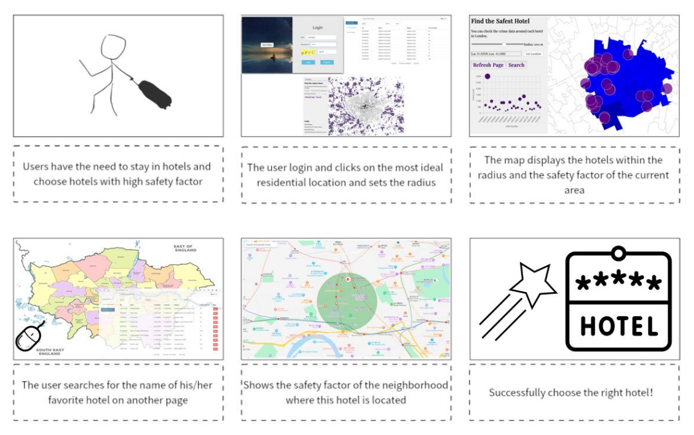

# CE-Web-Architecture-Tech-Titans

## StoryBoard
<center>
  
</center>

## Folder Structure

```none
CE-Web-Architecture-Tech-Titans
├── Config (Configuration for database login setting)
│   ├── crime database config.json (Config for crime database)
│   ├── hotel database config.json (Config for hotel database)
├── data (Raw data for analysis and visualization)
│   ├── London hotel information csv
│   ├── crime data (crime data with various categories in different LSOA)
│   ├── london lsoa csv (LSOA data for crime data mapping)
│   ├── london lsoa shapefile (Raw lsoa data from QGis)
├── docs (Some diagrams for project description)
├── src (source code for the whole website)
│   ├── map_search(Code for map search part, you can run it seperately!!)
│   ├── webapp (The final framework of our website)
├── tests (temp code for testing before integration)
│   ├── crime api (NodeJs for crime data request)
│   ├── hotel api (NodeJs for hotel data request)
│   ├── crime data processing.ipynb (Code for data processing)
├── .gitignore (ignore the config file in the repository)
├── README.md (Brief intro of the web project)
```


